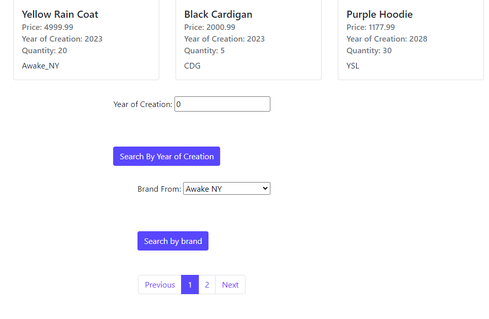
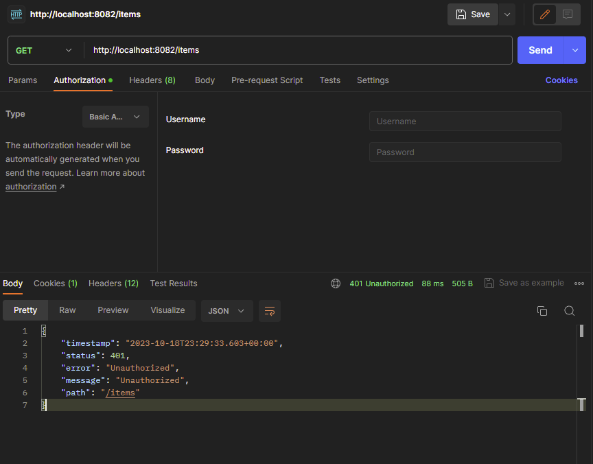
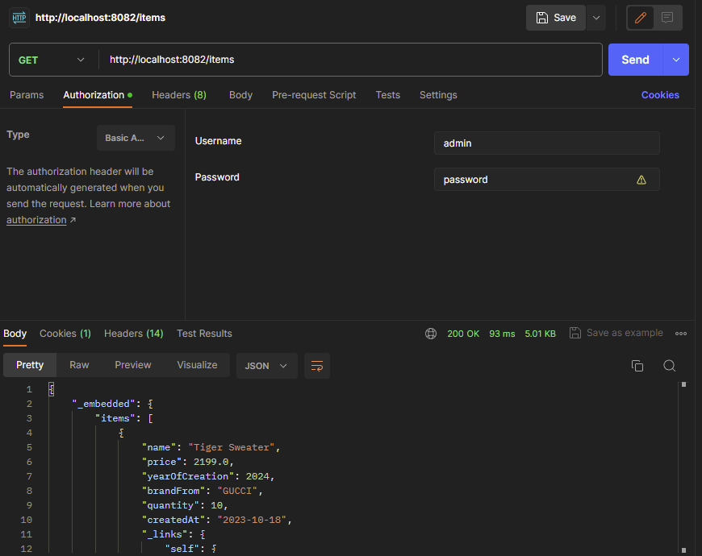

# Spring_Nerdstrom

This repository contains the frontend and backend for an E-commerce website named "Nerdstrom".

Java Springboot is used for the entirety of the app.

Connection to postgreSQL for persistence of data.

Backend RESTful API is locked behind basic authentication and also has expected functionalities such as gets, posts, deletes, and updates.

### Api credentials:
#### Username = admin
#### Password = password

This app was created as a final project for CPAN 228 at Humber College, functionality is fully implemented but styling certainly needs some love

Requires the front end and back end of the project both running but can be configured to either use in-app memory or connect to a Postgres database.

---

---

---

---
